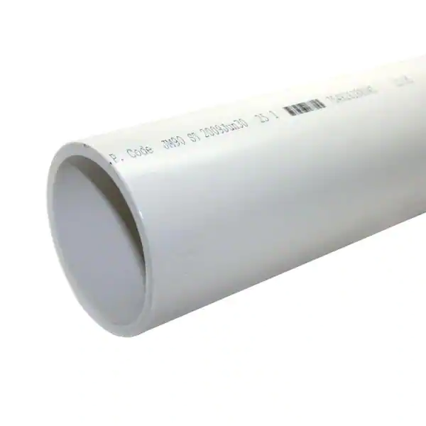
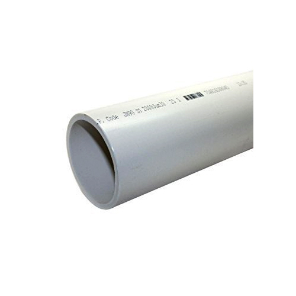
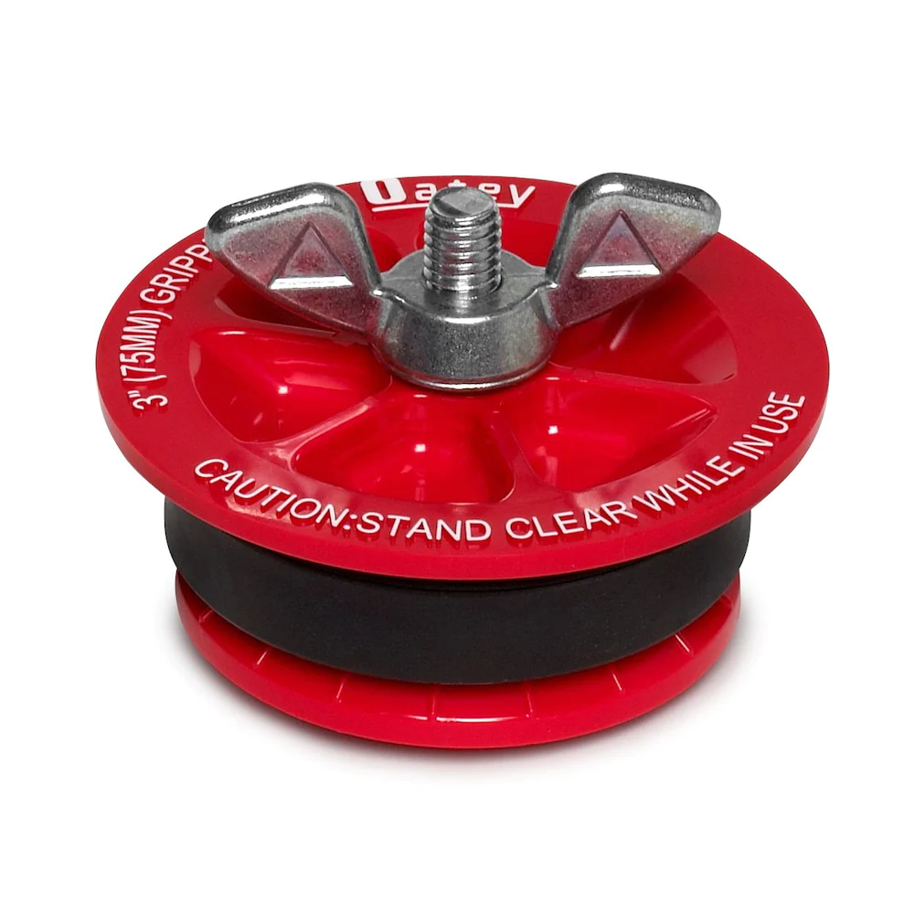
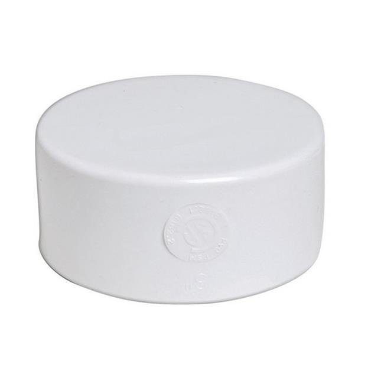
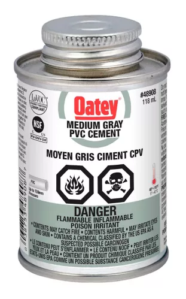
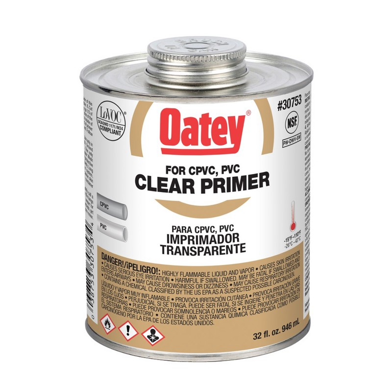
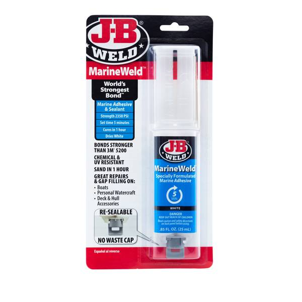
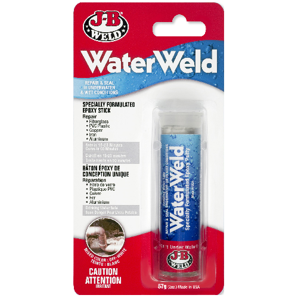
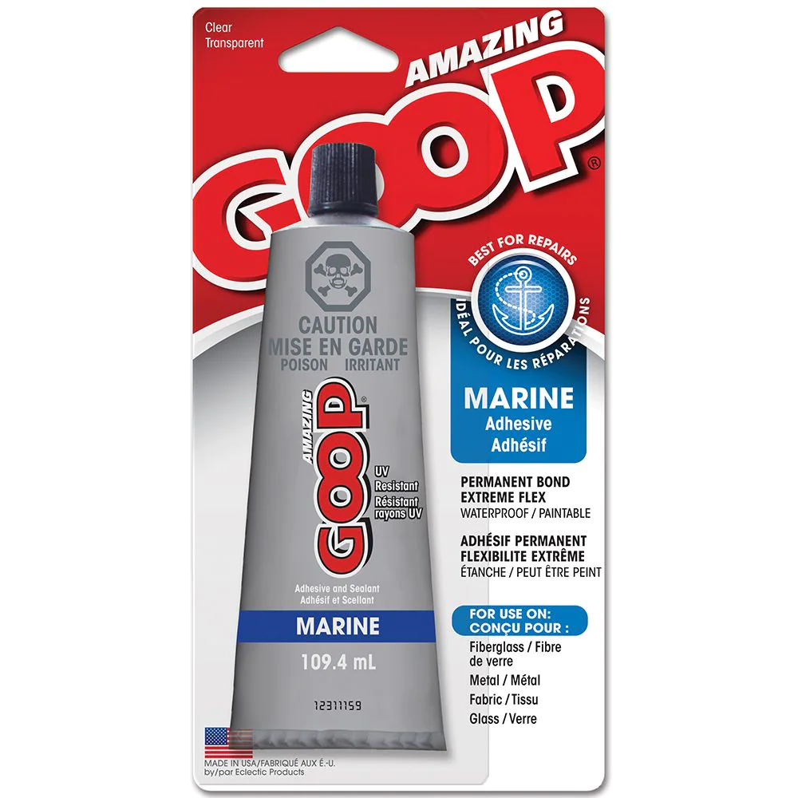

# Materials Information

## DIY1/2/3 Housing
The housing design is from [this project](https://coastal.msstate.edu/waves) by the Mississippi State University's [Coastal Research and Extension Center](https://coastal.msstate.edu/). See [this video](https://youtu.be/9Ifw1qYnSB8) ([@10:44](https://youtu.be/9Ifw1qYnSB8?t=644) for cap, [@22:15](https://youtu.be/9Ifw1qYnSB8?t=1335) for body) for a demonstration of how they assemble their sensors. Note that we use different hardware / electronics, but the housing is the same.

| Part                                 | Notes                                                                                             | Image                                                        |
|--------------------------------------|---------------------------------------------------------------------------------------------------|--------------------------------------------------------------|
| 10 in. length of 3 in. diameter PVC  |                                                                                                   |                         |
| ? in. length of 1.5 in. diameter PVC |                                                                                                   |                      |
| 3 in. diameter Oatey Gripper Cap     |                                                                                                   |  |
| 3 in. diameter PVC cap               | Top must be flat and smooth (branding text sanded off if present).  Edges can be sharp or smooth. |                  |
| PVC cement                           | Colour doesn't matter.                                                                            |                |
| PVC primer                           | Very runny, so clear colour is preferred.                                                         |               |
| Liquid Epoxy                         | Does not have to be transparent. Should be marine / water rated.                                  |          |
| Epoxy Putty                          | Should be marine / water rated.                                                                   |            |
| Goop Sealant                         | Should be marine / water rated.                                                                   |                  |