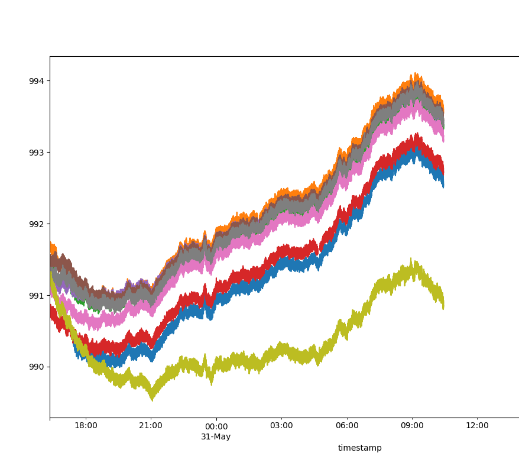

# Project Notes

*Ongoing notes are kept at the top of this file. Dated entries with various thoughts and findings follow.*

## Overview
These notes begin with the development of a new pressure sensor, after DIY2. With this new sensor, the goal is to be able to deploy multiple sensors nearshore ~~and maintain a wired connection from a central device(s?) on the shore to each sensor underwater. This will supply power to each sensor while also allowing them to transmit readings back to the shore in real time.~~

## Sensor Use Cases 

### Deployment
The sensor will be prepared and assembled within the housing before travelling to the deployment site. The sensor will be unpowered until it is ready to deploy. ~~At this point, the sensor will be plugged into a power supply / data channel "hub" via a waterproof cable, turning it on. Readings from the sensor should begin being transmitted to the shore hub.~~ If the sensor is functioning properly, it can be deployed underwater after an additional check to make sure the housing is properly sealed.

---
---

# 8 November 2022

## DIY4
A new design has been created! DIY4 is very similar to DIY3, with a few key differences: the shield PCB has been updated to include the changes I was making to each DIY3 shield by hand (this will save some time avoid some human error during assembly), and there is now space for a P-channel MOSFET on the shield that can turn power on and off to the SD card, allowing us to turn off the SD card during deep sleep. 

With DIY3, I was measuring around 0.26 mA of current during deep sleep, with occasional spikes in the hundred microamps range whenever a reading was taken. With DIY4, with the SD card off, I'm measuring 0.07 mA of current during deep sleep: a whole order of magnitude lower! There are some potential issues with turning on and off SD cards, as discussed in [this blog post](https://thecavepearlproject.org/2017/05/21/switching-off-sd-cards-for-low-power-data-logging/). Namely, even after your program is finished writing to a card, they may still be doing "housekeeping" tasks in the background, which you do not want to interrupt by removing power. [This issue](https://github.com/greiman/SdFat/issues/21) provides more details on the specifics. 

# 31 July 2022

## Flaws with DIY2
Now that DIY3 is matching or possibly outperforming DIY2, I can compare the two designs more closely.

- **Battery life**: DIY2 uses 2 larger C cell batteries, while DIY3 uses 3 AA batteries. This should easily make DIY2 the winner, but with the most recent ULP update to DIY3, this may not be the case. DIY2 lacks some of the simple power saving measures used by DIY3, such as disconnecting the DS3231 RTC from main power and using smaller capacity SD cards (though they could be swapped in).

- **Accuracy**: Both models use an MS5803 series pressure sensor. However, the DIY2 housings are equipped with the MS5803-14 model, while the DIY3 housings are equipped with the MS5803-05 model, which is a higher precision varient. This difference is noticeable in data results, but for the intended use of the sensors, the MS5803-14 is fine. Additionally, DIY2's code could easily be modified to function with a more accurate sensor.  
The bigger issue has to do with battery voltage. The nominal voltage of alkaline C batteries and AA batteries is 1.5V. So, the total voltage going into the system (before the voltage regulator) will be around 3V and 4.5V in DIY2 and DIY3, respectively. However, these voltages drop as the battery is used. This is fine for DIY3: it only requires 3.3V to function, so the voltage regulator on the FireBeetle will dissipitate any extra voltage as heat until the voltage drops below 3.3V, at which point the device will shut down. But for DIY2, which operates at 3V, there is a problem: the moment the battery drops below nominal voltage, the device is no longer operating at 3V. This should cause the devices to stop sampling relatively quickly (batteries don't stay at their nominal voltage for that long), but because the ATmega328P (and other components) can operate at a wide enough voltage range, the device continues to operate well below 3V. However, as the voltage changes, so do the readings of the MS5803 sensor: i.e. taking the same pressure reading at 3.3V, 3V, and 2.7V will all yield different results. See the yellow curve in the following image for a drastic example (its batteries were rapidly declining). 

This makes the data inconsistent with other sensors over time. Of course, the simple solution is to add more batteries, but this issue was something I didn't consider when I first designed DIY2, so I thought it was worth a detailed look.

- **Housing**: The housings for DIY2 and DIY3 are virtually identical, other than the MS5803-14 being used in DIY2 housings and the MS5803-05 being used in DIY3 housings. The last field visit revealed damage to some of the older DIY2 sensors, however. While there was no water inside any of the housings, a handful of them had stopped sampling at some point before we downloaded their data and wouldn't turn back on. I suspect that water managed to leak past the epoxy around the MS5803, and that's where it caused damage. We used several different liquid epoxies throughout DIY2 assembly, not all of them marine grade, and I think this was the mistake.  
Another issue I noticed was the build up of "gunk" around the sensor ports. Our sensors are currently deployed for the summer throughout several freshwater lakes, which makes them a great target for that kind of thing. I've seen more advanced housings use mesh or an oil bladder around the sensor port to protect it. If we continue to deploy the sensors for a month or more at a time, I think we'll need to do the same to increase the longevity of the sensor housings.

# 8 July 2022

## An odd DS3231 problem
While testing some new sensors that were just put together, I ran into some odd behaviour with the DS3231 boards I was using. It seemed like they worked fine when setting the time, reading the time, etc., but they didn't work in my main program. After a lot of fiddling around, I discovered the culprit was the coin cell batteries I was using. Although they were unused and no more than a year old, and my multimeter read a nominal 3V, it seemed as though they weren't working properly when the DS3231 was in battery backup mode. It would continue to keep the time, but the alarm functionality (perhaps all I2C as well) was simply not working. I'm not sure the reason for this issue as of now, but swapping to another coin cell brand seemed to solve the problem. (The culprit brand was Energizer, surprisingly).

# 7 July 2022

## ULP Integration
Over the last month I've been busy with some other projects while the sensors are collecting data in the field, but I've slowly been chipping away at figuring out how to use the ESP32's ultra low power coprocessor (ULP) to log sensor readings. I wanted to take this approach from the start with these sensors, because of the amount of energy that can be saved compared to the current approach (waking the whole ESP32 once per second to read the sensor), but I didn't have enough time before the first deployment to figure it out. As of now, I've got what I believe to be a working version of the ULP code integrated into the main DIY3 program, so I'll go over it here.

I've talked about using the Legacy Macros to program the ULP when I was first experimenting with it, and that ended up being my method of choice again here. I also made extensive use of the [HULP](https://github.com/boarchuz/HULP) library: it's a gold mine of functionality and examples when it comes to programming the ULP with the legacy macros. It also provided the functionality for bit banged I2C to communicate with the MS5803, but I'll get to that later. 

There were several things I had to figure out when I started developing the ULP program. I ended up creating a [testing program](/code/DIY3/testing/ulp/ulp.ino), and you can follow the progression of the code through the commit history of that file. But to summarize, when I started the test program, I already knew how to mess with GPIO pins, load data from RTC memory, and save data to RTC memory. In order to progress, I needed to learn how to use I2C on the ULP (and also actually learn the I2C protocol myself :) ). 

The ULP has some built in hardware functionality for I2C reading and writing, but it's very limited. One limitation is that you can only read and write 8 bit values. That's fine for the DS3231, for example, but the MS5803 returns a 24 bit value in order to communicate pressure / temperature readings. Another limitation is that you have to provide a *sub-address* in the assembly command. If you're not familiar with I2C, an example of a device that uses sub-addresses is the DS3231 again: if you want to write to its CONTROL register, you first send the address of the DS3231 via I2C, then you send the sub-address that you want to write to (i.e. the memory address of the CONTROL register), and finally you send the value to write. However, not all devices operate using sub-addresses, such as the MS5803. Instead, if you wanted to reset the sensor, for example, you would just send the MS5803's I2C address followed by the reset command, no sub-address. This meant I needed to find an alternative to using the ULP's hardware I2C, and that alternative would be *bit banging*.

Bit banging is when you "simulate" a communication protocol in software instead of using hardware. So to bit bang I2C on the ULP, I needed "functions" for writing and reading I2C in ULP assembly. Luckily, someone else had already written them: the HULP just so happens to implement bit banged I2C. When I first looked at it, I thought it only had functionality for 8 bit and 16 bit reads and writes, along with the sub-address issue from before. However, instead of reading through the entire library (unfortanetly it can be lacking in the documentation department), I went on a tangent and wrote my own I2C bit bang, which is still buried in the test file's commit history if you're interested. In the end, I discovered the HULP did have a more flexible bit banged I2C implementation, which is what I use in the final version as of now. If you're not familiar with the I2C protocol, you should take a few minutes to learn it beforehand, though (that's all it takes, it's very simple).

One other recommendation is to use another device (such as the ESP32's main processor) to listen on the I2C wires (you can connect whatever pins you use for bit banged I2C right to the ESP32's hardware I2C bus if you want) and display the transmissions on a serial monitor. This allows you to trace your I2C transmissions, a very useful tool for debugging. I certainly wouldn't have figured out the issues I ran into without it. The code I used for this is buried in the ULP testing file I've mentioned, but if I have time I'll make it a standalone script somewhere. Although, I bet such scripts already exist if you look for them.

Once I had I2C working, I just had to figure out how to use a buffer / array to store the data from the MS5803, which wasn't too difficult. Because the ULP is only a 16 bit processor, it would be difficult (perhaps impossible) to implement the conversion algorithm for processing the raw readings from the MS5803 into meaningful pressure and temperature values, so instead the ULP just stores the raw values in a buffer until it's full. Then, when the main processor wakes up, it converts all the raw data into corresponding pressure and temperature values before storing the data to the SD card. More complexity could be added to the ULP program, perhaps an SPI bit bang to write directly to the SD card... but there's a max ULP program size which has to be bypassed in order to do this, plus I can't be bothered to develop an SPI bitbang for the SD card when I intend to switch to a straight up flash chip in the future.

# 8 June 2022

## SD card alternatives
SD cards have been the center of a number of issues in the data loggers so far. Their convenience and high capacity might not be worth all the trouble to find genuine cards and save power. Additionally, the commercial data loggers I've seem don't seem to make use of any kind of removeable storage. Instead, I assume they include flash storage chips, or something similar. I've considered flash storage in the past, but the limited number of write / erase cycles deterred me (usually flash chips guarantee around 10000 to 100000 cycles). But after reconsidering it now, realistically this would be plenty!

The main downside to using flash chips, or at least the first one that comes to mind, is the capacity. Looking through DigiKey, the pickings are slim even just to match the 512MB SD card currently assigned to each logger. It's important to note that, at least on DigiKey, capacity is measured in K*b* or M*b* (bits), not K*B* and M*B* (bytes). So to find a similar capcity flash chip to the 512MB SD card, we need a `512Mb * 8 = 4Gb` flash module. Most of these higher capacity flash modules require large pinouts (48 pins), would be difficult to solder since they're surface mount, and can be expensive. [This](https://www.digikey.ca/short/9fm84vzd) 2Gb chip could work, especially if I can optimize the data that needs to be stored, but perhaps it's worth reconsidering how much capacity is actually needed. Again, commercial loggers, such as the RBR TWR logger that I use to calibrate these loggers, don't have a massive capacity for storing data. Instead, it records data only at scheduled intervals and can store averages instead of raw data. The scheduling features were implemented in MS2's code, but we never made use of them because we had so much storage. 

So, supposing I optimize space by storing timestamps less regularly (i.e. only store a timestamp at the beginning of each hour and assume every sample is a second apart), then even without scheduling / averaging there will be a major improvement. 4 bytes for pressure + 1 byte for temperature = 5 bytes per sample. If sampling at 1Hz, on [a 512Mb flash](https://www.digikey.ca/short/f2n3d91w), there will be room for approximately  
`500Mb / 8 bits = 62.5MB`  
of data. So  
`62.5MB / 5B per sample = 12,500,000 samples`.  
And finally,  
`12,500,000 samples / 86,400 samples per day = 182 days`  
of data. Plenty!

The next factor to consider is how to interface with the device. Both of the items above use SPI on the hardware side of things, but I'm not entirely sure what library to use to actually interact with the device. SPIFFS seems to be relevant, but I've never used it before and so I'm probably missing some nuances. There also don't seem to be all that many community projects involving flash chips over SD cards, either.

# 6 June 2022

## First deployment
These notes are mainly focused on the development and electronics of the sensors, but I think their application is worth going over briefly. The transducers are far from a final product, but the deadline for the first deployment has come and passed and several sensors are now in the field, at 1m depths in various lakes in Muskoka, Ontario just offshore. (The scrambling to test and finish the sensors beforehand has left a lot of undocumented work!) Several DIY3 sensors were paired up with the old MS2 / DIY2 sensors for redundancy as we deployed them. To keep the sensors underwater, we acquired cement deck blocks from the MS2 / DIY2 project and zip tied the sensors to the blocks with 2 big loops all the way around. Time will tell if it will be strong enough to hold, but I think there are other issues to consider, too. 

The sensor housing, which is the same as MS2 / DIY2, has not been tested for more than a day underwater (at least, not by me). Mostly I wouldn't expect any issues: if there was a gap in the epoxy or PVC cement, we would know pretty quickly. However, the gripper cap could be very prone to human error. Since the sensors were only turned on right before they were deployed, we couldn't put all the caps on beforehand, and instead we had to twist each one on in the field. This is easy enough to do, but I can't say for certain whether each cap was twisted on with equal force, or whether they will remain water tight for a month.

Additionally, the DIY3 battery life still hasn't been properly tested, which is why we paired several of the sensors with old MS2 / DIY2 ones. I had started a prototype with some early code back in early to mid May and left it running, and it lasted for around 2 weeks before the voltage began to drop below 3.3V, but the batteries may have been used / old and the code was not as optimized as the "final" version in this deployment.

Finally, the MS5803-05 being exposed (just the sensor port, obviously not the electronics which are covered in an epoxy) may degrade it over time.

## SD card issues
Once again, the SD cards need to be addressed. After looking through some overnight test data from the sensors, I've noticed that several of them have chunks of data missing from the SD card periodically. Not missing in a corrupted way, but missing as though it just wasn't saved. These chunks of data just so happen to be the same size as the buffer. This leads me to believe that the logger itself is functioning fine, but something is going wrong when it tries to save to the SD card. I still have yet to figure out the cause with certainty, but my guess is that the quick spikes in current draw that happen during save events might be too much for the FireBeetle and/or the batteries to handle. I tried solving this by lowering the buffer size to reduce the amount of data being written and adding a 10uF capacitor to each microSD module, and it seemed to alleviate the problem a bit, but there are still chunks missing every now and then. I suppose adding more capacitors in parallel would fix the problem if it is what I think it is, but otherwise I'm not sure what a cleaner solution would look like.

## Power Consumption Revisited
With the sensors going into the field, I wanted to estimate their battery life. Since I don't have the proper equipment to accurately log current draw at a high resolution, I made some very rough estimates with a multimeter. By noting the running time of the program and the current being read by my multimeter when the sensor was active vs sleeping, I ended up with an estimated average current draw of 3mA (at 10MHz processor speed). The sleep current of the sensor is <1mA (0.5mA was measured on one of the sensors, so I'll use that figure), and the active current spikes are typically around 30mA, although some are much higher. While running at 10MHz, the sensor usually takes ~90000us (90ms) to complete a cycle of the program and go back to sleep. In other words, the sensor is awake for 9% of every second, which can be generalized to just being awake for 9% of the time and asleep for the other 91%. This allows us to calculate the average current as `(9% * 3mA + 91% * 0.7mA) / 100% = 3.3mA`. Of course, there could be spikes that my multimeter misses or other factors I haven't considered, but I'm hoping to verify this result in the future by seeing how long the sensors run for during deployment. 

# 23 May 2022

## Solution to Problem with the DS3231 Module
After several days of tinkering with the module and some code (most of which was spent forgetting that binary numbers must be prefixed with 0b...), I've come to a workaround for the problems mentioned previously. 

Firstly, I removed most of the components from the DS3231 module, including the troublesome resistor blocks. Since pull up resistors are still needed for I2C, I added some to the ESP32 shield instead. Now that the pull up resistors are independent of the module, I can even communicate with the DS3231 when it's on battery backup power (though I2C may drain the coin cell faster), and I don't need to turn on the DS3231 to read from the MS5803-05. The other components (the EEPROM and its resistor block) were removed from the module simply because I don't use them, and I don't want them wasting energy.

Secondly, I switched from Adafruit's [RTClib](https://github.com/adafruit/RTClib) to a less sophisticated [library](https://github.com/rodan/ds3231) for the DS3231. There's a lot going on under the hood in RTClib, and I couldn't figure out an easy way to keep an RTC_DS3231 object persisting across a deep sleep reset (just storing the object as a RTC_DATA_ATTR wasn't enough). This means I have to recreate the object after every reset, which seems like unnecessary work. The new library is lower level and not as polished or documented, but I was able to get it working. Currently, I have some working [code](../code/DIY3-esp32/testing/ds3231_battery_alarm/) to read the time, set an alarm to pulse every second, and then operate only in battery backup mode. All that's left is to make sure the library will work nicely with deep sleep resets (it should since it's just functions, no global variables / OOP). 

# 13 May 2022

## Problem with the DS3231 Module
I've been trying to generate alarms using the DS3231 module in order to wake up the ESP32. Most libraries make this easy when the chip is powered (VCC is powered, that is), but a certain control register bit must be set in order for this to work only on battery power. However, even after setting this bit, I haven't been able to generate alarms or a squarewave once the DS3231's VCC power is set to low. 

After looking around a bit, I came across a forum post that mentioned that the INT/SQW pin is actually connected to VCC via a resistor (see the [schematic](https://www.onetransistor.eu/2019/07/zs042-ds3231-battery-charging-circuit.html)). These resistor blocks, which are also the pull-up resistors for I2C in the design, are now becoming a bit of a headache rather than a conveniance. Currently, in order to communicate with either the DS3231 *or the MS5803-05*, the DS3231 module has to have power on its VCC, which I power via a GPIO pin. This is because I2C requires pull up resistors to work, and those pull up resistors are connected to the DS3231 module's VCC. However, having learned that the INT/SQW pin is also pulled up here (unnecessarily, since I can just use the INPUT_PULLUP mode of the ESP's GPIO pins), I've now realized that the module also must have VCC power when I want to use the alarms (i.e. always)! Otherwise, if VCC is not powered, the resistors become pull down resistors and overpower the ESP32's internal pull ups. And since the DS3231's alarm is active low, it will look like the alarm is always active. Not good.

# 11 May 2022

## Problem with ULP and I2C
As I started looking into the issue of how to communicate to the MS5803-05 using the ULP and I2C, I ran into an immediate problem that I hadn't accounted for: the ULP uses different pins for I2C than the main processor. In fact, the ULP can't even interact with the default I2C pins since they aren't RTC GPIO pins. This is a problem, since I would have to further modify each sensor board by hand, soldering connections from the ULP accessible I2C pins to the default I2C pins, in order to make use of the ULP. It's doable, but adds more assembly time and room for human error. Plus, I'm not familiar enough with I2C to be confident that I can implement it on time in ULP assembly. So, for the time being, I'm going to put the ULP approach on the backburner and use the same approach as DIY2: wake up the main processor every second, read in a sample, and go back to sleep. A major improvement I can still make here is to buffer the data, and only save it to the microSD a few times a day.

## Smaller microSD cards
I ordered some [512MB cards](https://www.adafruit.com/product/5252) from Adafruit ([through DigiKey](https://www.digikey.ca/short/tnh7294f)). 512MB is plenty for this kind of data logging, assuming the data is stored efficiently (i.e. as binary data, which will need some post-processing to be readable). Although I haven't tested all the cards yet, they appear to draw significantly less current. Compared to the 32GB Sandisk card which drained >1mA while idle, the 512MB card was only drawing just under 0.4mA. While this is still a lot, it's a noteable improvment.

If each reading takes a 4 byte timestamp, a 4 byte float (pressure), and a 1 byte int (temperature), then each reading will require 9 bytes. Assuming 400,000,000 Bytes of space (I want to account for any bad memory or packing that might go on under the hood), then the card will be able to store approximately  
`400,000,000 Bytes / 9 Bytes per sample = 44,444,444 samples`  
Assuming a sampling rate of 1Hz, then the sensor will have space to run for 514 days. If this isn't enough, then we can remove the timestamp from each reading and instead assume each reading is 1 second apart. This method would only require 5 bytes per reading, leaving room for 80,000,000 samples or 925 days of data at 1Hz.

# 10 May 2022

## Working with the ESP32's ULP Coprocessor
(I'm just going to call it the ULP). The ULP is one of the main reasons why I considered the ESP32 despite how power hungry it could be. Based on what I read during my research, it seemed that the ULP couldn't be used for very complex tasks, but it could still interact with certain GPIO's, interact with certain memory (that was shared with the main processor), and communicate via I2C. This was perfect, because it would allow me to read from the MS5803 without even having to wake up the main processor! However, diving into the ULP has been quite a challenge so far.

The first thing to figure out is how you're going to program it. If you're using the ESP's native framework, this isn't a problem and it's well documented by Espressif. However, if you're using the Arduino ESP framework (like me), then here's a list of what I've tried:
1. The [ulptool](https://github.com/duff2013/ulptool) project seemed promising, but I wasn't able to get it working. It might be abandoned at this point, and I don't think it's compatible with newer versions of the ESP Core framework for Arduino. I tried changing to an older version of the framework, but it broke my code and I can't be bothered to migrate backwards.
2. You can migrate your project to the native framework for the ESP. However, I'm using several libraries built for Arduino, and I don't have time to port them to a different framework, although this would likely be the cleanest option in the end.
3. It turns out you can program the the ULP at runtime using some [legacy macros](https://docs.espressif.com/projects/esp-idf/en/v3.3.5/api-guides/ulp_macros.html). It's a little janky and there aren't many examples I can find, but so far it's been working in my program. 

If you choose option 3, there's an amazing little project that makes working with the macros *slightly* higher level called [HULP](https://github.com/boarchuz/HULP). It doesn't offer much more in the way of standalone documentation, but most of the functions are commented well, and there are a number of examples. Even better, the project appears to be active at the time of writing this.

## JST Connectors and Crimping
In DIY2's design, I created a connector for the MS5803-14 using Dupont connectors. Although they're great for prototyping, they aren't the best choice for a finished product. My biggest gripes with them are that they can be plugged in the wrong way and they don't always make a solid connection. 

So as an alternative for this project, I wanted to use JST connectors. They seemed like a good fit since the MS5803-05 wouldn't have to be unplugged from the board very often (JST connectors aren't technically meant for applications where there's a lot of plugging in and unplugging). I included a footprint for the 4-pin PH variant (there's [a lot](https://en.wikipedia.org/wiki/JST_connector) of JST connectors) and then proceeded to buy precrimped wires for the *SH* variant... which used 2.54mm pin spacing instead of the 2mm *PH* footprint on my board. 

Since the 2mm variant is less common, I couldn't find long enough precrimped wires for my design, so I had to order a kit of various JST PH connectors and a pair of Engineer Crimpers off Amazon to crimp my own (make sure you have wire strippers too, and that your wire is the right AWG for the type of JST connector). I found crimping to be much less frustrating than soldering wires to male Dupont header pins, and the end product was a clean and foolproof connector for the MS5803-05 wires. It certainly would have been faster to find precrimped wires, but crimping your own is not an unrealistic approach either.

# 6 May 2022

## Reducing the ESP32's Current Draw 
There were a number of things one could configure with the ATmega328p to save energy: disabling the ADC, reducing the CPU frequency, etc. With the ESP32, I've been looking into similar functionality. As measured previously, the device with all components attached (FireBeetle board, MS5803-05, DS3231 module, microSD card) drains ~44mA while idle (but not sleeping). The FireBeetle ESP32 is responsible for most of this current draw, given that it's running at a whopping 240MHz and doing... the same thing the ATmega328p was doing at 8MHz (and even that is probably overkill). 

So the first thing to reduce is the CPU frequency, which can easily be done at runtime with the `setCpuFrequencyMhz` function. The [docs](https://docs.espressif.com/projects/esp-idf/en/latest/esp32/api-reference/system/power_management.html) only show three frequencies from 240MHz to 80MHz, but more are listed in the header file, all the way down to 10MHz (though below 80MHz you can't make use of WiFi / BlueTooth). 

The ADC seems to be disabled until it's actually needed, so there's nothing to worry about there. As for WiFi and BlueTooth, those are also disabled by default. Those seem to be the easy targets, but if any more modules can be disabled then I'll take note of them.

# 5 May 2022

## Sleep Current Tests
Today I wired up a sensor and uploaded a demo of what the setup code will be: initialize the RTC, initialize the SD card, initialize the MS5803-05, and then go to sleep. I then measured the current going to the system under different conditions. 

The ESP32 alone will drain tens of milliamps when it's not sleeping, this is why it will be crucial to make use of the ULP coprocessor (ultra low power) to take measurements if possible, or minimize the time spent awake otherwise. With just the MS5803-05 wired up to the ESP32, I observed around 40mA being drained by the system during the setup code, 0.2mA at the beginning of sleep, and 0.1mA shortly after. This was surprisingly high, since I had observed the ESP32 sleeping at only 0.013mA (or 13uA), and the MS5803-05's datasheet claims it functions at <1uA and sleeps at <0.15uA (150 nano Amps!). 

Continuing with the tests, however, I introduced the DS3231 module into the circuit with [a GPIO pin powering VCC](https://thecavepearlproject.org/2014/05/21/using-a-cheap-3-ds3231-rtc-at24c32-eeprom-from-ebay/) (i.e. the DS3231's VCC is wired to a GPIO pin so it can be easily switched off when I2C is not needed. I noticed that a short delay was needed after reenabling VCC power before you could communicate again). I expected the current consumption to be the same as before once the GPIO pin powering the DS3231 was set to low, but instead the sleep current went even lower: all the way down to 0.013mA, or 13uA, the sleep current of just the ESP32! At first I thought my circuit was either wrong now or wrong in the last setup, but after retesting both circuits, the results were the same. Although I'm not entirely sure why this is the case, I think it has to do with the fact that the design relies on the pull-up resistors found on the DS3231 module for the I2C lines, which weren't present in the previous circuit. Whatever the reason, this result was very promising.

Finally, I introduced the microSD to the circuit. Without a card inserted into the module, the setup consumed no additional current compared to the last test (as one would hope from an open circuit...). With the card, however, around 1.2mA of current was being devoured by the system. In other words, if the only function of this device was to sleep, the microSD card would consume 9000% more energy than the rest of the circuit...

# 3 May 2022

## Controlling Power to the microSD Card
Being unfamiliar with the available options for electronic switches, my first thought was to use a BJT (a basic kind of transistor) to toggle the power to the card on and off using a GPIO pin from the MCU (I can't just pin power the card because current spikes during certain operations could exceed the ESP32's max current draw from GPIO pins). The card itself would be connected to the 3V3 line of the FireBeetle board. Unfortunately, it seems BJTs see a relatively large voltage drop across the collector and emitter (I was measuring ~0.5V using an SS8050 NPN transistor) which would knock the voltage down too far for the microSD (it should be at 3.3V). 

A little extra reading introduced me to an alternative solution: MOSFETs. These transistors function similarly to BJTs, but they switch on/off based on a voltage threshold (rather than current with BJTs), and more importantly, they tend to have much lower voltage drops. As of now, my understanding is that a low-side logic-level N-channel MOSFET would be a good choice for this project. (Low-side means the MOSFET goes after the microSD in the circuit, N-channel is like how BJTs have NPN vs. PNP, and logic-level means the threshold voltage of the device is low e.g. 2.5V or lower for a 3.3V MCU.) [This one, the IPP055N03LGXKSA1](https://www.digikey.ca/en/products/detail/infineon-technologies/IPP055N03LGXKSA1/1996759), might do the job.

I might not have time to add this to the current design before the upcoming deployment, however, and this could really impact battery life. Assuming a capacity of 2000mAh in the 3 AA alkaline batteries, and a sleep current of 0.5mA without switching off the microSD, the device would naively last for around 2000/0.5 = 4000 hours. This isn't so bad, but in reality the device will be drawing more current, and sleep current *should* be <0.1mA. When the ESP32 wakes up to take a sample, it could draw several mA of current for a short period of time. Writing to the microSD, even if I can buffer several hours of data, is also capable of eating up current. I can't really estimate the impact on longevity without more tests, but I doubt it will be negligible.

# 2 May 2022

## Beginning Construction of the First DIY3 Board
The custom PCB has been designed, ordered, and received. I used JLCPCB as the boardhouse and it turned out great, but as expected, I'm already noticing design issues.

After reading up on the Cave Pearl Project's notes on [saving power with microSD cards](https://thecavepearlproject.org/2017/05/21/switching-off-sd-cards-for-low-power-data-logging/), I realized that I underestimated the power consumption of the microSD card and DS3231. Using some DeepSleep example code from the ESP32 framework for Arduino, and after cutting [a connection on the board itself](https://wiki.dfrobot.com/FireBeetle_Board_ESP32_E_SKU_DFR0654#target_4) (see the "Low Power" pad), I was able to get the FireBeetle's current consumption down to ~10 uA as expected. However, just adding the RTC module and microSD card to the circuit bumped the current consumption up to between 0.4 mA and 1.2 mA depending on the microSD card. I'm thinking about dealing with this the same way the Cave Pearl Project did: pin power the RTC module and use a transistor (a BJT) as a switch to toggle the power to the microSD during sleep. Unfortunately, that means I'll have to do some janky soldering on the custom PCB, which I'll have to redesign in the future.

# 14 April 2022

## Getting ready to order the parts
There's a lot of scattered thinking involved when ordering parts for something you haven't fully thought out and tested. The main aspects of the sensor are the same as with DIY2: MS5803-05B pressure transducer (we used an MS5803-14BA for DIY2 but the hardware footprint is identical between all the models), DS3231SN (or DS3231M) RTC breakout, microSD breakout. However, since the parts won't be assembled on a breadboard, I have to think about how I'll be wiring things together. 
- Like with DIY2, I'm planning on wiring the MS5803 and DS3231 to the same I2C bus to communicate with the ESP32; the question is, what is the fastest and easiest way to merge the 4 wires from the MS5803 and the 4 wires from the DS3231 into 4 wires that feed to the ESP32 I2C bus (and power)? 
    - I could solder four junctions of three wires. I don't want to do this. I find that oldering wires together is finicky and time consuming. It would also be ideal to have a solution where I can still disconnect each components from one another.
    - Another solution I looked into was to lead male Dupont wires (or similar) from each of the MS5803 and DS3231 and have them connect to a 2x4 female Dupont connector that would somehow merge them and lead back to the ESP32. The more modular design would be nice, but I'm not quite sure how I would actually merge each pair of wires into one still. This would also likely require the use of a crimping tool and kit, which myself and others who want to build this device would need to buy.
    - [Wego lever nuts](https://www.wago.com/ca-en/lp-221) are a cool way to join wires, but they could be a bit too expensive to use in bulk. There are other solutions for joining wires like this, likely inexpensive, but also permanent. So finally, here's the solution I'm looking at.
    - I could design a custom PCB shield for the FireBeetle to mount connectors for the MS5803 cable, the DS3231 (directly or via cable), and even the microSD board. The traces on the PCB would merge the two I2C connections into the ESP32. Everything could remain modular. Soldering through-hole on a PCB is easy. And since the PCB is just for a couple signal connections and through-holes, I could utilize a relatively cheap manufacturer.

## Creating a Custom Shield for the FireBeetle
The first thought that came to my head when starting this idea was to attach a microSD card port right to the board and ditch the microSD breakout. Hey, I could do the same thing with the DS3231. Actually, I might as well just make the whole ESP32 board myself and -- no. Because then I would have to assemble it myself, and so would anyone else who uses this design. This is one issue I had with the OWHL: if you have the tools to make it, it's a very high quality DIY design. If you don't, it's going to be a daunting investment of time and money that many researchers would not make. Yes, there are board houses that will assemble your PCBs too, but I feel that is beyond the scope of a DIY project like this one. Or maybe it isn't, it's something to investigate later.

So no PCB? Well a PCB might still be useful. The microSD and DS3231 breakout boards are inexpensive (somehow I can buy 4 DS3231SN or M breakout boards on ebay for the price of one DS3231SN chip on Digikey...) and already assembled, that's why we chose them as opposed to making our own PCB with the same components. However, as I mentioned in the above section, the components must now be wired together somehow, rather than connected easily via traces in a PCB. Unless... I just create a shield with a few easy to solder through-hole connectors for the MS5803 cable, DS3231 module, and microSD module that handles all the "wiring" for me. Bingo!

# 3 March 2022

## Change of Plans
This batch of sensors no longer needs to be wired: instead it will once again be battery powered and save data (most likely) to an SD card, essentially the same as DIY2. At this point, an Arduino nano or pro mini could likely be used instead of a handmade board like DIY2 or the FireBeetle. However, I'd like to continue testing.

# 1 March 2022

## Software for Programming an ESP32
There is support for ESP32 programming in the Arduino IDE, but I'd like to have the Intellisense perks that come with an editor like VS Code. I have both the Arduino extension and PlatformIO (PIO) extension set up now. I'm thinking it will be best if I begin programming under the Arduino framework (either using the extension directly or under PIO) since I'm familiar with it, and once I have the functionality I want, I may convert to Espressif's framework for the ESP32 (still under PIO) if there are any major benefits for doing so.

## Prototyping
I'll be ordering 2 or 3 FireBeetle boards, 3 or 4 MAX3485 chips (with boards to break out the SOIC-8 package to pin holes), possibly some ethernet ports. I'll also need to pick up some ethernet cable for long range wired communication and power testing. The goal for a prototype is to have each of the 2 or 3 ESP32 boards read from a pressure sensor (MS5803-14BA) and send the data to the same "hub" computer. This will cover the main desired functionality for the finished sensors.

# 26 February 2022

## Long Range Data Transmission cont.
- Power loss is another factor that needs to be considered here: there will be a voltage drop at each sensor, which could become problematic if the cable is too long. This is because the cable I currently intend to use (ethernet cable of some kind) has very small gauge copper wire, which is less effective for power transmission.
- An additional transceiver component will be needed to use RS-485 communication. There are some very cheap breakout boards available on Amazon and other places that work at 5V, but I'm intending for this project to work at 3(.3)V (maybe this should change?) considering the ESP32 chip requires a voltage in this range. Sparkfun sells a [board](https://www.sparkfun.com/products/10124) that works at 3.3V, but based on the price and the reviews I'd be better off using a chip like this [Maxim one](https://www.maximintegrated.com/en/products/interface/transceivers/MAX3485.html) ([DigiKey link](https://www.digikey.ca/en/products/detail/analog-devices-inc-maxim-integrated/MAX3485CSA-T/1703654)) with perhaps a custom PCB or a small bare breakout PCB for whatever package type the chip comes in. I'm going to investigate the cost of a custom PCB, with room for an ethernet port or other wire connector.

# 25 February 2022

## Long Range Data Transmission
Each sensor will be connected to the shore hub via a wired connection in order to receive power and transmit data. However, this distance will undoubtedly be longer than just a few meters, making communication protocols like I2C and SPI ineffective. If the sensors are to be underwater, Wi-Fi is (probably) not an option either. For this reason, a longer range wired communication protocol will be required, like [RS-485](https://www.omega.ca/en/resources/rs422-rs485-rs232), as well as a transceiever in order to use it. The cable used is also important: twirled pair cables (like in ethernet cables) reduce interference. The cable will need to be waterproof, which is supposedly best achieved by an outdoor rated gel filled cable.

    
# 24 February 2022

## New Course of Action
Although I would like to design my own PCB for a project at some point, I need to learn more about the ESP32 before I can do that for this project. After further research, the [FireBeetle](https://www.dfrobot.com/product-1590.html) ESP32 development board seems like a very good alternative to a self made board (which would essentially need the same features for this project). It boasts a deep sleep current of just 10 μA and will keep development time on track. 

  
# 23 February 2022

## Plan of action
I think I'll design a PCB using an ESP chip first, since power savings aren't an issue for the current use case. If the power consumption of the ESP chip can't be reduced enough, an STM32 design might be fleshed out in the future.

## Choosing an ESP Chip

### Why switch from the ATMEGA328p?
- Likely due to chip shortages and the age of the chip, it's difficult to find sellers who stock it. Current lead times from DigiKey were around a year. This has led me to consider two other chips: the STM32 and ESP32.

### ESP32 vs. STM32 main differences so far:
- ESP has Wi-Fi / Bluetooth capability whereas STM does not.
- STM may be more power efficient out of the box; in order to save power on the ESP, it looks like I'll need to use the Ultra Low Power coprocessor while keeping the main processor in deep sleep most of the time. The downside here is that the coprocessor might have to be programmed in assembly.
- ESP packages seem to be physically bigger than STM packages.

### There are [4 Series](https://www.espressif.com/en/products/modules) to consider 

- [ ] ESP8266 Series
    - Oldest model, this one has some security issues and lacks Bluetooth which is a feature I'd like to have as an option. It's very commonly used despite these issues, however.
- [x] ESP32 Series
    - Like the above chip, but with security issues fixed and Bluetooth capability. This is the Series I first considered.
- [ ] ESP32-C Series
    - Newer and has every feature I'm looking for except for the ultra low power co-processor, which I think I'll need in order to pursue a low power model that could compete with STM32 chips.
- [x] ESP32-S Series
    - Broken up into S2 and S3: S2 ditches the Bluetooth connectivity ~~which makes it a no go~~, S3 is the newest Series and is also currently out of stock on Digikey, otherwise this might be a viable frontrunner. 
    - **UPDATE**: Having discovered that Bluetooth is limited to ~1Mb/s transfer speed, I think using a Wi-Fi connection is the way to go. For this reason, I don't really care about Bluetooth, and instead prefer the S2 model or the ESP32 base one. 

### There are various "Modules" of the ESP32 Series to consider
*Note: Modules are listed by ESP Series on the page linked in the previous section.*

- Some modules have a "PCB antenna" as a trace built directly into the module's PCB, whereas others have an "IPEX antenna" which I believe requires you to connect an external wire / antenna piece.
    - Without having done much research, I think the PCB antenna should suffice. I would only need it to communicate with a device directly next to the sensor, maybe a phone held up against the sensor housing.
- Some modules allow you to select from varying amounts (4, 8, 16 MB) of flash (program) memory.
    - The 8 MB flash option appears to be the least expensive option in stock for some of the modules on DigiKey, so I'll choose this if the option is there. I'm not worried about program space given the ATMEGA328p's comparatively miniscule flash memory.
- There is one major difference that I have found between modules from the WROOM series and modules from the WROVER series: modules from the WROVER series come with an additional 8 MB PSRAM (pseudo static RAM) chip inside the module package which gives the module a significant amount of additional (slightly slower?) memory to use.
    - Considering I was able to comfortably use the 2KB of RAM and 32KB of flash provided by the ATMEGA328p for the DIY2 design, I don't think I need a WROVER series module which may drain more power with the extra RAM chip. The ESP's ~500 kB of RAM should be plenty.
- The package size is another thing to consider. While the mini version appears to have all the same features as the standard packages, it might be harder to handle / install by hand. 
    - Since I don't think space will be a major constraint, I will choose the standard larger package size.
- There are several revisions of the modules I've narrowed down (first iteration: ESP32-WROOM-32, ..., later: ESP32-WROOM-32D, ..., most recent: ESP32-WROOM-32E). The 32E module changes a few major things from the 32D and 32 modules: it fixes some security bugs where one could access the code on the chip and some read/write bugs, but most importantly it turns GPIO pins 17-22 into NC (no connect) pins. I *believe* this is because they were meant to be used to connect to additional external program memory in older versions, but with E they package that additional memory within the chip
    - The 32E module is slightly cheaper than the D (at least from what I saw on DigiKey). While I wouldn't consider the improvements the E offers over the other versions necessary for the project (I don't think the GPIO pins lost in the E are gamebreaking), I see no reason why I shouldn't begin modelling and testing with this version to begin.

**My module of choice: the ESP32-WROOM-32E**

